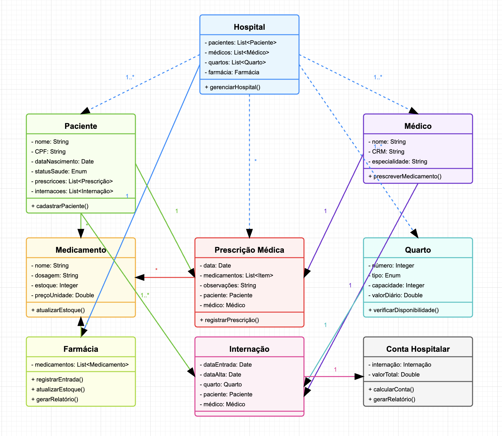

# 📄  Sistema de Gerenciamento Hospitalar

## 📌 Contextualização

O objetivo deste projeto é desenvolver um sistema orientado a objetos para gerenciar o funcionamento interno de um hospital de médio porte. O sistema deve permitir o controle de pacientes, internações, quartos, prescrições médicas e uma farmácia interna, além de calcular os custos associados ao atendimento hospitalar.

---

## 🧑‍⚕️ Entidades e Regras de Negócio

### 1. Paciente
- Atributos: nome, CPF, data de nascimento, status de saúde (infectado, não infectado, curado, óbito), e prescrições.
- Cada paciente pode:
  - Estar internado ou não.
  - Ter diversas prescrições médicas associadas.
  - Possuir um histórico completo de internações.

### 2. Médico
- Atributos: nome, CRM, especialidade.
- Cada médico pode:
  - Prescrever medicamentos para pacientes.
  - Ser responsável por internações.

### 3. Prescrição Médica
- Atributos: data, lista de medicamentos prescritos (com dose e quantidade), observações clínicas, .
- Relacionamentos:
  - Deve estar ligada a **um paciente**.
  - Deve estar associada a **um médico**.
  - Cada item prescrito deve estar relacionado a **um medicamento** da farmácia.

### 4. Medicamento
- Atributos: nome, dosagem, quantidade em estoque, preço por unidade.
- Um medicamento pode aparecer em várias prescrições.
- Ao prescrever um medicamento:
  - O sistema deve verificar a disponibilidade no estoque.
  - Atualizar o estoque da farmácia automaticamente com base na quantidade usada.

### 5. Farmácia
- Contém uma lista de medicamentos.
- Responsável por:
  - Registrar entrada de novos medicamentos.
  - Atualizar estoques automaticamente a partir de prescrições.
  - Gerar relatórios de consumo por paciente e por medicamento.

### 6. Hospital
- Representa o sistema central.
- Contém:
  - Lista de pacientes cadastrados.
  - Lista de médicos.
  - Lista de quartos.
  - Acesso à farmácia interna.
- É o ponto de integração de todas as entidades.

### 7. Quarto
- Atributos: número, tipo (isolamento, enfermaria), capacidade, valor diário de internação.
- Pode conter múltiplos pacientes, respeitando sua capacidade.
- Deve impedir que um paciente seja internado em dois quartos ao mesmo tempo.
- Deve registrar a data de entrada e a data de alta.

### 8. Internação
- Atributos: data de entrada, data de alta (ou null), quarto, responsável médico.
- Cada paciente pode ter múltiplas internações, mas apenas uma ativa por vez.
- Relacionamentos:
  - Ligada a **um paciente**.
  - Ligada a **um quarto**.
  - Ligada a **um médico**.

### 9. Conta Hospitalar
- Calculada automaticamente ao dar alta ao paciente.
- Deve considerar:
  - Valor diário da internação × número de dias.
  - Soma do custo de todos os medicamentos prescritos durante o período.
- O sistema deve gerar esse valor como uma saída (ex: relatório de custos).

---

##  Objetivos do Sistema

- Permitir o cadastro e gerenciamento de pacientes.
- Registrar prescrições médicas com controle de medicamentos.
- Controlar internações e ocupação de quartos.
- Gerenciar o estoque da farmácia.
- Calcular a conta hospitalar por paciente.
- Manter histórico completo de cada paciente.

## Diagrama UML

### Projeto anterior

link: https://github.com/CaduRoriz/trabalho2020OO